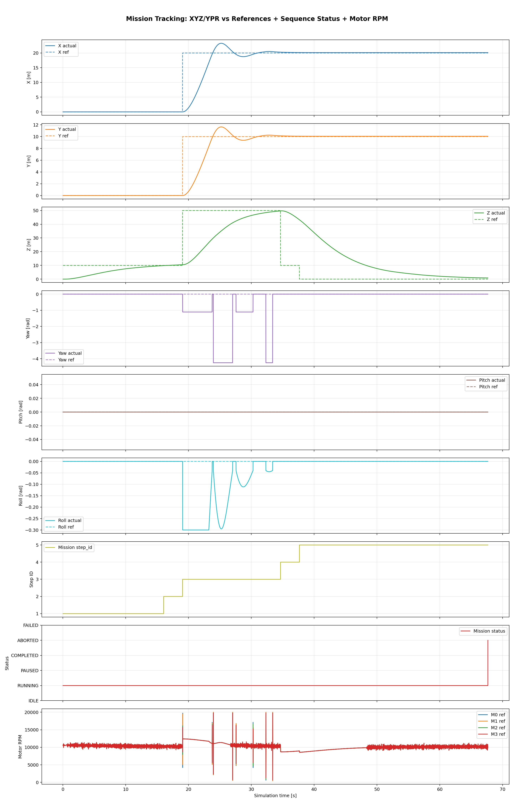
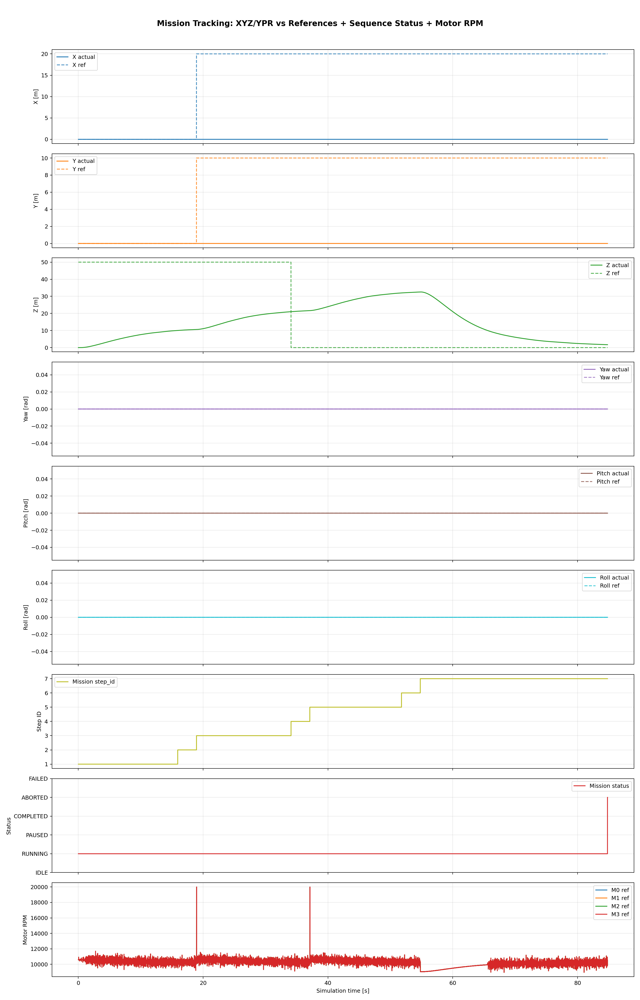

# virtDrone
**Vehicle Subsystem Simulation & Control Framework (Work in Progress)**

## Overview

virtDrone is a modular framework for exploring vehicle subsystem modeling and control-loop integration.

The current implementation is intentionally **simplified** and aimed at engineering workflow exploration, not high-fidelity flight prediction.

## Documentation

Detailed documentation lives in the `docs/` folder:

- [Documentation Index](docs/README.md)
- [Architecture](docs/architecture.md)
- [How to Use](docs/how-to-use.md)
- [Simulation Mission Format](docs/simulation-mission-format.md)
- [Simulation ↔ Real Drone Interaction (Beginner Guide)](docs/tutorials/simulation-real-drone-interaction.md)
- [Current State](docs/current-state.md)
- [Roadmap](docs/roadmap.md)
- [Changelog](docs/changelog.md)

## Quick Start

### Build and Run (Docker)

```bash
docker compose run --rm dev cmake -B build -G Ninja -DCMAKE_BUILD_TYPE=Debug
docker compose run --rm dev cmake --build build --target simulator_app
docker compose run --rm dev ./build/simulator_app 1000 0.01
```

### Generate Chart

```bash
docker compose run --rm chart
```

### Run Chart Parser Tests

```bash
docker compose run --rm chart-test
```

Default chart output:

- `docs/tutorials/charts/flight_dashboard.png`
- `docs/tutorials/charts/mission_xyz_status.png`

### Mission Examples (Current Testing)

Two mission flows are actively used for execution/testing:

- `config/missions/hover_and_move.yaml`
- `config/missions/hover_and_land.yaml`

Example Docker run from repository root (hover and move):

```bash
docker compose run --rm dev bash -lc "cd /workspace/build && ./simulator_app 10000 0.01 ../config/altitude_controller.yaml ../config/attitude_controller.yaml ../config/weather.yaml ../config/missions/hover_and_move.yaml ../docs/tutorials/"
```

Example Docker run from repository root (hover 10m -> 20m -> 30m -> land):

```bash
docker compose run --rm dev bash -lc "cd /workspace/build && ./simulator_app 10000 0.01 ../config/altitude_controller.yaml ../config/attitude_controller.yaml ../config/weather.yaml ../config/missions/hover_and_land.yaml ../docs/tutorials/"
```

### Mission Trend Screenshots

Hover and move mission trend:



Hover and land mission trend:



For mission log/chart details, see [How to Use](docs/how-to-use.md).

## Status Snapshot

### Current Mission Testing Focus

- Active scenario under test: mission profile that hovers at 10m, then 20m, then 30m, and finally lands.
- Latest mission visualization is available in `docs/tutorials/charts/mission_xyz_status.png`.
- The general mission backbone (load -> run -> step transitions -> completion/termination logging) is now working and usable for iteration.

### Mission Execution and Control Status

- Mission execution is now operational end-to-end for the current examples (`hover_and_move`, `hover_and_land`).
- Position regulator and altitude regulator are both working in the mission loop.
- Current tracking accuracy is acceptable for development and is expected to improve mainly through tuning.
- Sensor-noise modeling is implemented and actively affects regulator behavior, so control quality is validated under non-ideal sensing.

### Completed

- Split control/simulation runtime architecture
- ENU translational dynamics with yaw/pitch/roll thrust projection
- Common + differential motor mixing (`common_motor_rpm` + yaw/pitch/roll terms)
- Battery-aware motor behavior (including depletion cutoff), plus thermal/current telemetry
- GPS perfect-state propagation from ENU to geodetic + noisy GPS sensing path
- Configurable weather disturbance model (steady, gust, turbulence)
- Ground-lock constraint to prevent movement while clamped on ground
- RealDrone-integrated XY position controller (position/velocity feedback -> pitch/roll references)
- Default-enabled XY position hold outside mission mode (auto-latched current XY hold reference)
- Mission YAML support with step-based execution (time-based and completion-based advancement)
- YAML-configurable position-hold tuning (`position_hold_enabled`, `position_hold_kp_pos`, `position_hold_kp_vel`, `position_hold_kd_vel`, `position_hold_max_velocity_mps`, `position_hold_max_tilt_rad`)
- Extended telemetry and charts (weather panel + dual-axis energy/temperature view)
- Mission loader + executor tests and position-controller unit coverage

### In Progress

- Stabilizing mission behavior across altitude transitions and landing sequence.
- Improving regulator tuning for tighter position/altitude tracking and smoother transitions.
- Cleaning up variable naming/units and reducing inconsistencies across runtime, telemetry, and mission parsing paths.
- Mission strict-validation mode for unknown schema values (currently permissive fallback)
- Richer rigid-body rotational dynamics
- Scenario-driven comparison workflows and broader robustness/fault coverage

### Scope Note

The simulator intentionally remains simplified for control-development workflow iteration rather than high-fidelity digital-twin prediction.

## Known Issues

- Mission workflows are functional but still in active debugging/tuning; several edge cases remain before behavior is considered reliable.
- Some variables and conventions are not yet fully consistent across components.
- Position and altitude regulation are working, but accuracy/robustness still vary by scenario and disturbance level.
- Sensor noise is intentionally injected and can expose weak tuning; this is expected during current tuning-focused development.
- Use tutorial artifacts for evaluation and debugging: `docs/tutorials/simulation_telemetry.csv`, `docs/tutorials/simulation_events.log`, and charts under `docs/tutorials/charts/`.

## License

See [LICENSE](LICENSE) for details.
