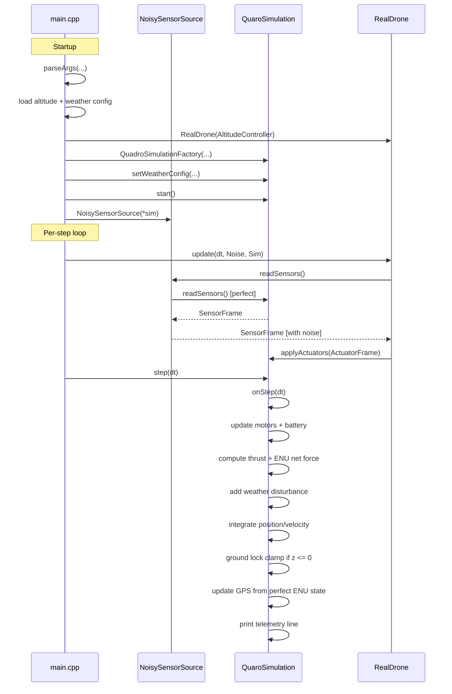

# Simulation ↔ Real Drone Interaction (Beginner Guide)

This page explains, in order, how the simulation side and the "real" drone control side interact during a run.

## Big Picture

- `RealDrone` is the controller side (decides motor commands).
- `QuaroSimulation` is the plant side (simulates motors, battery, physics, GPS, weather).
- `NoisySensorSource` sits between them and adds measurement noise.

## Startup Call Order

When `src/simulator/main.cpp` starts:

1. `parseArgs(...)`
2. Load altitude config (`AltitudeControllerConfig::loadFromFile(...)`)
3. Load weather config (`WeatherConfig::loadFromFile(...)`)
4. Build controller: `AltitudeController(...)`
5. Build runtime: `RealDrone real_drone(alt_ctrl)`
6. Build simulation: `QuadroSimulationFactory(...)`
7. Inject weather: `sim->setWeatherConfig(weather_config)`
8. Start simulation: `sim->start()`
9. Wrap sensors with noise: `NoisySensorSource noisy_sensor_source(*sim)`

## One Simulation Step (Exact Runtime Loop)

Each loop iteration in `main.cpp` does:

1. `real_drone.update(dt_s, noisy_sensor_source, *sim)`
2. `sim->step(dt_s)`

That means control computes first, then plant advances.

## Sequence Diagram

## What `RealDrone.update(...)` does

At high level:

1. Reads current sensors through `SensorSource` (already noisy).
2. Computes altitude and attitude control terms.
3. Builds actuator command:
   - common RPM (`common_motor_rpm`)
   - differential yaw/pitch/roll terms
   - per-motor mixed RPM references
4. Sends command through `ActuatorSink::applyActuators(...)` to simulation.

## What `QuaroSimulation.step(...)` does

Inside `onStep(...)` it:

1. Applies latest motor setpoints.
2. Updates motor physics and battery state.
3. Computes thrust and ENU force dynamics.
4. Adds weather acceleration/force.
5. Integrates ENU motion.
6. Applies ground lock at contact (`z <= 0`).
7. Updates perfect GPS state from ENU pose/velocity.
8. Emits telemetry (`S/P ...`, `PosENU`, `YPR`, weather fields, etc.).

## Why this split matters

- The controller side never sees perfect plant internals directly.
- Noise is introduced only on sensor transport.
- Physics remains internally consistent while control sees realistic measurements.

## Quick Mental Model

- `RealDrone` = "brain"
- `QuaroSimulation` = "body + environment"
- `NoisySensorSource` = "imperfect sensors/wiring"
