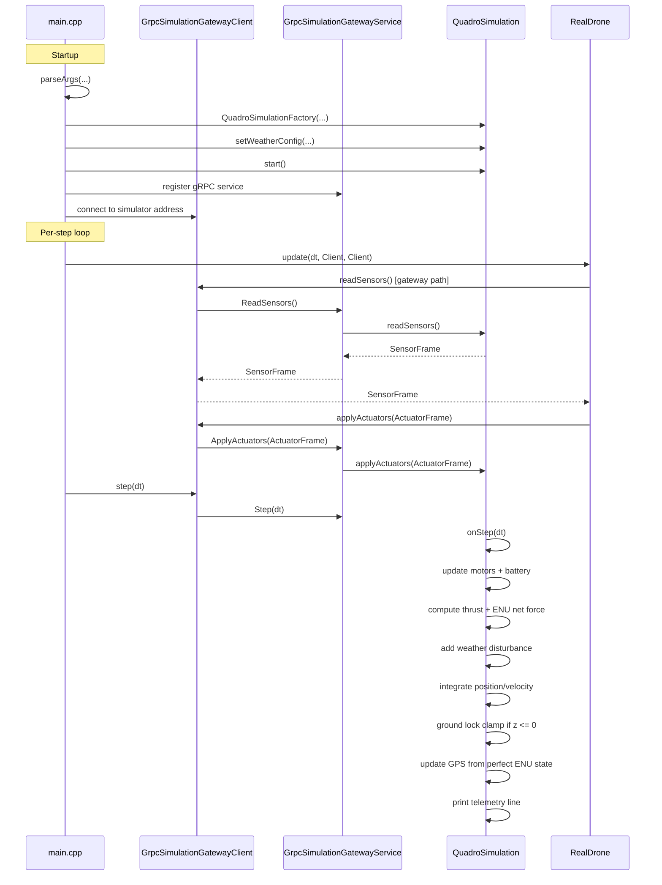

# Simulation ↔ Real Drone Interaction (Beginner Guide)

This page explains, in order, how the simulation side and the "real" drone control side interact during a run.

## Big Picture

- `RealDrone` is the controller side (decides motor commands).
- `QuadroSimulation` is the plant side (simulates motors, battery, physics, GPS, weather).
- `SimulationGateway` is the process boundary contract.
- `GrpcSimulationGatewayService` lives in the simulator process.
- `GrpcSimulationGatewayClient` lives in the control process.
- `proto/simulation_gateway.proto` is the transport contract source of truth.

## Startup Call Order

When `src/simulator/main.cpp` starts:

1. `parseArgs(...)`
2. Load weather config (`WeatherConfig::loadFromFile(...)`)
3. Build simulation: `QuadroSimulationFactory(...)`
4. Inject weather: `sim->setWeatherConfig(weather_config)`
5. Start simulation process: `sim->start()`
6. Register `GrpcSimulationGatewayService`
7. Start the gRPC server and wait for control commands

When `src/drone/main.cpp` starts:

1. `parseArgs(...)`
2. Load altitude + attitude config
3. Build controller: `AltitudeController(...)`
4. Build runtime: `RealDrone real_drone(alt_ctrl)`
5. Connect `GrpcSimulationGatewayClient` to the simulator server
6. Use the RPC helper path: `runSimulationStep(real_drone, gateway, gateway, gateway, dt_s)`

## One Simulation Step (Exact Runtime Loop)

Each loop iteration in `main.cpp` does:

1. `runSimulationStep(real_drone, gateway, gateway, gateway, dt_s)`
2. Inside that helper: `RealDrone` reads sensors, writes actuators, then the client forwards `step(dt)` to the simulator server

That means control computes first, then plant advances, with the simulator process treated as an explicit gRPC server.

## Sequence Diagram

```mermaid
sequenceDiagram
    participant Main as main.cpp
    participant Client as GrpcSimulationGatewayClient
    participant Server as GrpcSimulationGatewayService
    participant Sim as QuadroSimulation
    participant Real as RealDrone

    Note over Main: Startup
    Main->>Main: parseArgs(...)
    Main->>Sim: QuadroSimulationFactory(...)
    Main->>Sim: setWeatherConfig(...)
    Main->>Sim: start()
    Main->>Server: register gRPC service
    Main->>Client: connect to simulator address

    Note over Main: Per-step loop
    Main->>Real: update(dt, Client, Client)
    Real->>Client: readSensors() [gateway path]
    Client->>Server: ReadSensors()
    Server->>Sim: readSensors()
    Sim-->>Server: SensorFrame
    Server-->>Client: SensorFrame
    Client-->>Real: SensorFrame
    Real->>Client: applyActuators(ActuatorFrame)
    Client->>Server: ApplyActuators(ActuatorFrame)
    Server->>Sim: applyActuators(ActuatorFrame)

    Main->>Client: step(dt)
    Client->>Server: Step(dt)
    Sim->>Sim: onStep(dt)
    Sim->>Sim: update motors + battery
    Sim->>Sim: compute thrust + ENU net force
    Sim->>Sim: add weather disturbance
    Sim->>Sim: integrate position/velocity
    Sim->>Sim: ground lock clamp if z <= 0
    Sim->>Sim: update GPS from perfect ENU state
    Sim->>Sim: print telemetry line
```

## What `RealDrone.update(...)` does

At high level:

1. Reads current sensors through `SensorSource` (already noisy).
1. Reads current sensors through `SensorSource`.
2. Computes altitude and attitude control terms.
3. Builds actuator command:
   - common RPM (`common_motor_rpm`)
   - differential yaw/pitch/roll terms
   - per-motor mixed RPM references
4. Sends command through `ActuatorSink::applyActuators(...)` to the gateway boundary.

## What `QuadroSimulation.step(...)` does

Inside `onStep(...)` it:

1. Applies latest motor setpoints.
2. Updates motor physics and battery state.
3. Computes thrust and ENU force dynamics.
4. Adds weather acceleration/force.
5. Integrates ENU motion.
6. Applies ground lock at contact (`z <= 0`).
7. Updates perfect GPS state from ENU pose/velocity.
8. Emits telemetry (`S/P ...`, `PosENU`, `YPR`, weather fields, etc.).

## Why this split matters

- The controller side never sees perfect plant internals directly.
- Sensor transport can be noisy, but that behavior should live behind the boundary, not inside the control app.
- Physics remains internally consistent while control sees realistic measurements.

## Quick Mental Model

- `RealDrone` = "brain"
- `QuadroSimulation` = "body + environment"
- `NoisySensorSource` = "imperfect sensors/wiring"
